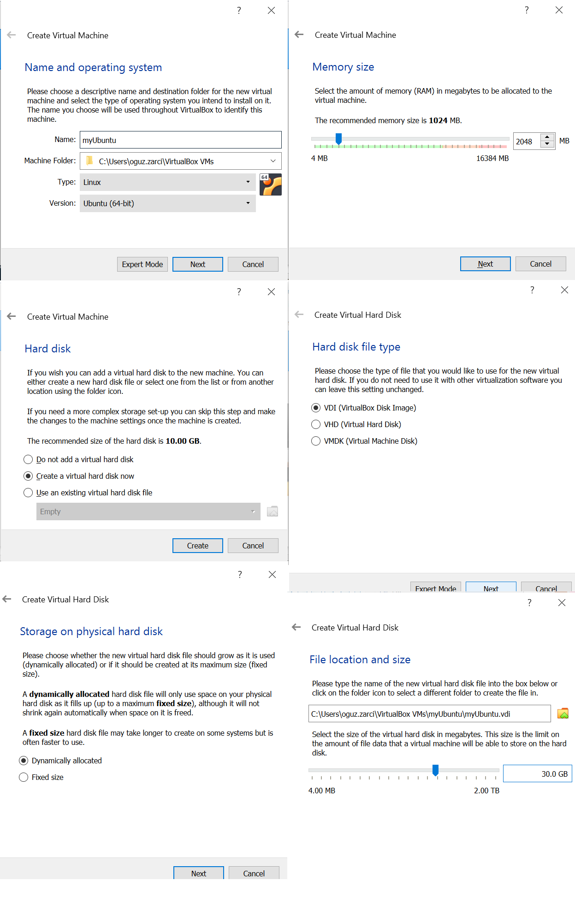
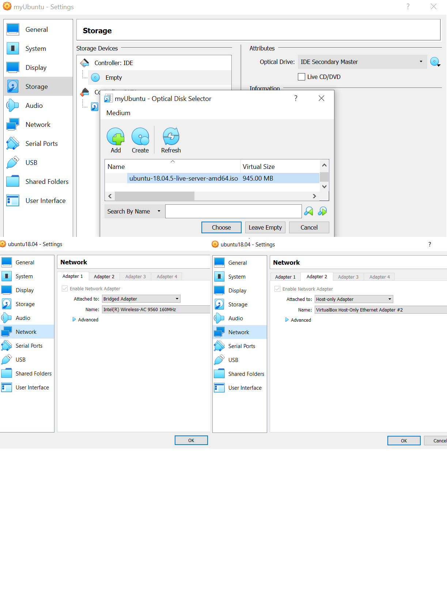
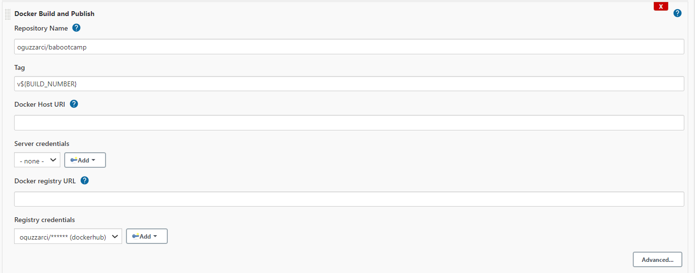
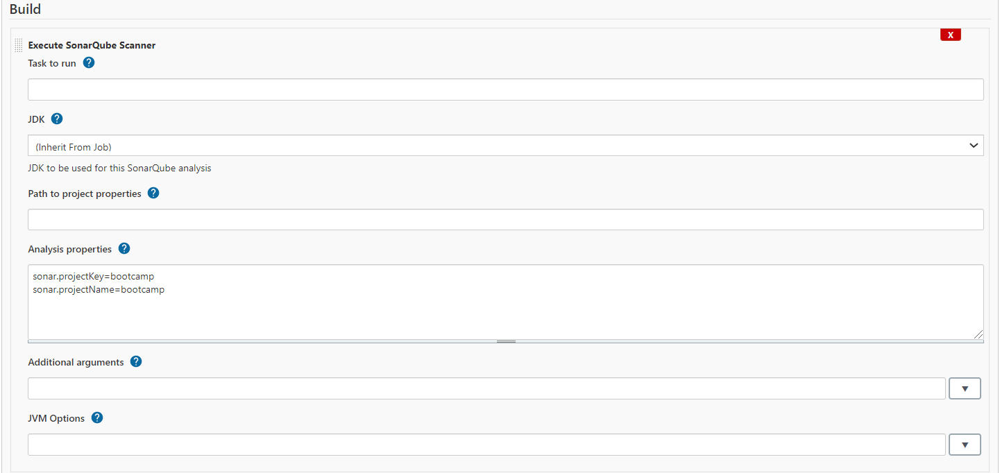

# Install Ubuntu Server Image
```
https://releases.ubuntu.com/18.04/ubuntu-18.04.5-live-server-amd64.iso
```
# Install Putty
```
https://the.earth.li/~sgtatham/putty/latest/w64/putty-64bit-0.74-installer.msi
```
# Create VirtualBox Ubuntu VM



# Install GitBash
```
https://git-scm.com/download/win
```

# Jenkins
```
sudo apt-get install openjdk-8-jdk
wget -q -O - https://pkg.jenkins.io/debian-stable/jenkins.io.key | sudo apt-key add -
sudo sh -c 'echo deb http://pkg.jenkins.io/debian-stable binary/ > /etc/apt/sources.list.d/jenkins.list'
sudo apt update
sudo apt upgrade
sudo apt install jenkins
sudo systemctl start jenkins
sudo ufw allow 8080
sudo ufw allow 22/tcp
```

```
sudo ufw status : Status: inactive ise
sudo ufw enable
sudo ufw default deny
sudo ufw allow 22/tcp
sudo ufw allow 8443/tcp
```

## Jenkins IP and Default Pasword
```
http://localhost:8080

cat /var/lib/jenkins/secrets/initialAdminPassword
```

## Jenkins Plugins
* CloudBees Docker Build and Publish

* SonarQube Scanner



# Docker Install
```
sudo apt-get update
sudo apt-get upgrade

curl https://releases.rancher.com/install-docker/19.03.sh | sh
```

```
Jenkins user'ın docker grubuna eklenmesi
sudo usermod -aG docker jenkins
```

# Kubectl Install
```
curl -s https://packages.cloud.google.com/apt/doc/apt-key.gpg | sudo apt-key add -
sudo touch /etc/apt/sources.list.d/kubernetes.list 
echo "deb http://apt.kubernetes.io/ kubernetes-xenial main" | sudo tee -a /etc/apt/sources.list.d/kubernetes.list
sudo apt-get update
sudo apt-get install -y kubectl
sudo reboot
```

# Choco Install
```
Set-ExecutionPolicy Bypass -Scope Process -Force; `
  iex ((New-Object System.Net.WebClient).DownloadString('https://chocolatey.org/install.ps1'))
```

# Minikube

```
Powershell yönetici olarak çalıştırılır.
choco install minikube

minikube start --cpus 4 --driver=virtualbox

Minikube hata verirse.
bcdedit /set hypervisorlaunchtype off
```

# Jenkins User
```
Jenkins User Home: /var/lib/jenkins
su jenkins
cd
mkdir .kube
cd .kube
vi config
Copy  configfile
[ESC] :wq!

Test için;
kubeclt get nodes

NAME       STATUS   ROLES                  AGE   VERSION
minikube   Ready    control-plane,master   20d   v1.20.2

```

# Kubernetes
```
kubectl create namespace dev
kubectl create namespace test
kubectl create namespace prod
```


# SonarQube Start
```
docker run -d -v ${pwd}:/root/src --name sonarqube -p 9000:9000 -p 9092:9092 sonarqube
```


## Others
* Delete docker images
```
docker images -a | grep "days" | awk '{print $3}' | xargs docker rmi -f
```
* https://lingojam.com/TexttoOneLine
* ip route add 192.168.99.0/24 dev enp0s3
  
  Open the command line
  Set your username:
  git config --global user.name "serkan.tasci"
  Set your email address:
  git config --global user.email "aliserkantasci@gmail.com"
  değişiklik new